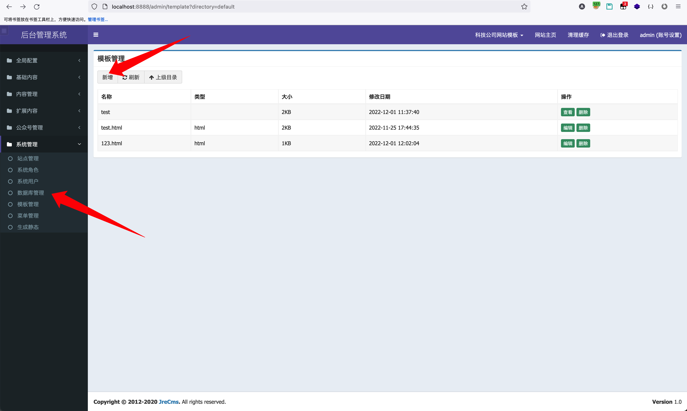
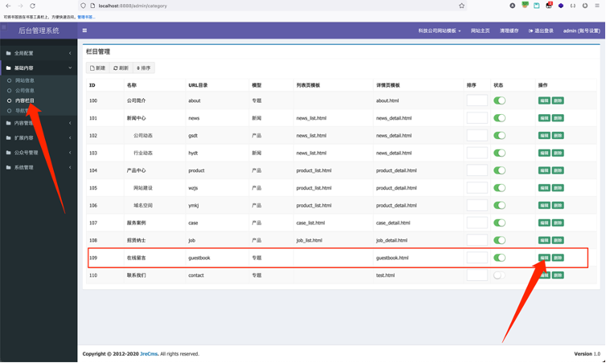
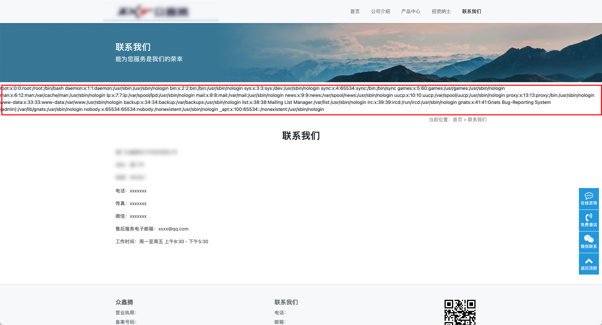
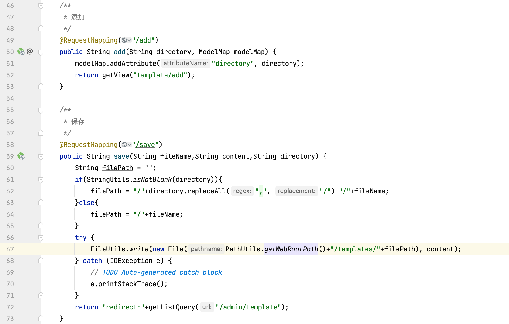

## JreCMS template injection vulnerability

The rapid development of JreCMS, dynamic addition of fields, user-defined labels, dynamic creation of database tables and crud data, database backup and restore, dynamic addition of sites (multi site function), and one click generation of template code make it easy to open
Build your own independent website, which is also convenient for secondary development, allowing you to quickly build personalized independent websites.
Background functions include:
Global configuration (configuration parameters, model management)
Basic content (website information, company information, content columns)
Content management (content data, label management)
Extended content (message information, rotating pictures, friendship links, customized tables, customized data)
Official account management (WeChat menu)
System management (site management, system role, system user, database management, template management, menu management)
The JreCMS background management system can add a template file and call the user-defined template file in the column introduction, so that we can edit a template file with malicious command execution and use it in other columns
Call to implement a remote command execution vulnerability.
This vulnerability can be used to execute server system commands and obtain system information.
Vulnerability address: http://ip:8888/admin/template?directory=default
Code download address: https://gitee.com/heyewei/SpringBootCMS.git
Vulnerability location: after logging in to the system, the template management interface adds the basic content of the template interface, and the content column calls the user-defined template.

### Exploit

Log in to the background system, click the system management interface template management, and add a template HTML file, such as adding a test.html A malicious template file that can execute the "cat /etc/passwd" command.




After the malicious template file is added, go to the basic content  content column and select a column to call the malicious template file we just added.




After setting, you can directly access this column to directly execute commands.



Other commands can be executed by modifying the form of execution command.

### Code audit process

Track new templates and save template interfaces. File path: src/main/java/com/cms/controller/admin/TemplateController Java lines 49 and 58.



Go to the pom.xml file to determine that the template engine introduced is Freemaker.


Since it is Freemarker, let's find out in the code whether there is blacklist filtering for some sensitive functions when the template is declared, such as Execute and other methods. Found src/main/java/com/cms/utils/TemplateUtils Java analyzes whether the content of this Java class is filtered.


In the process of reading and writing, the content of the template is not filtered, so it can be determined that there is a Freemarker template injection vulnerability.
Payload is as follows:

```java
<#assign value="freemarker.template.utility.Execute"?new()>${value("open -a Calculator")}
<#assign value="freemarker.template.utility.ObjectConstructor"?new()>${value("java.lang.ProcessBuilder","open -a Calculator").start()}
<#assign value="freemarker.template.utility.JythonRuntime"?new()><@value>import os;os.system("open -a Calculator")
```

