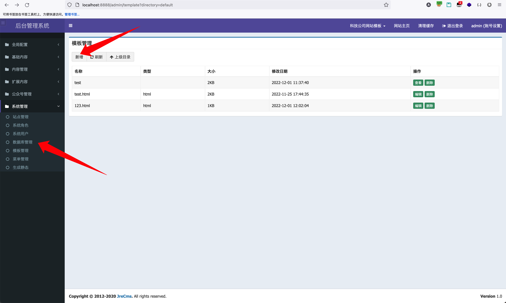
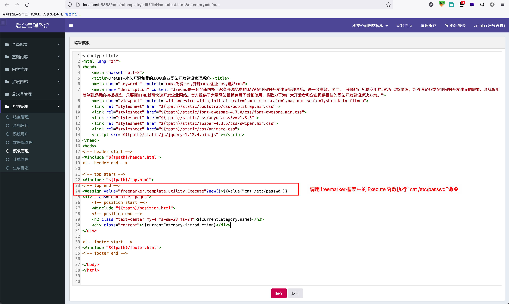
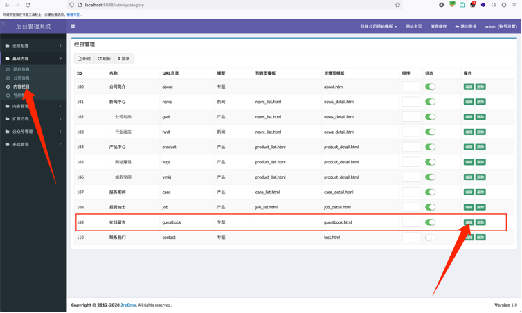
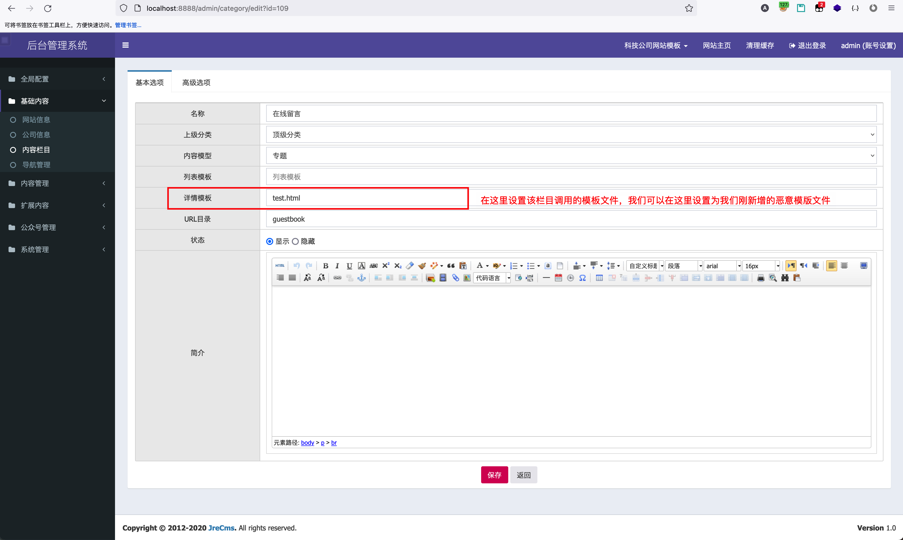
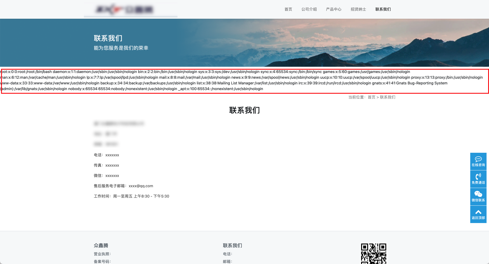
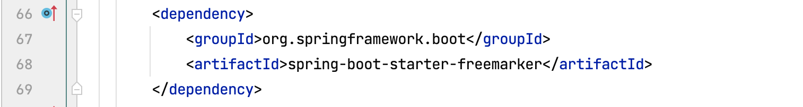
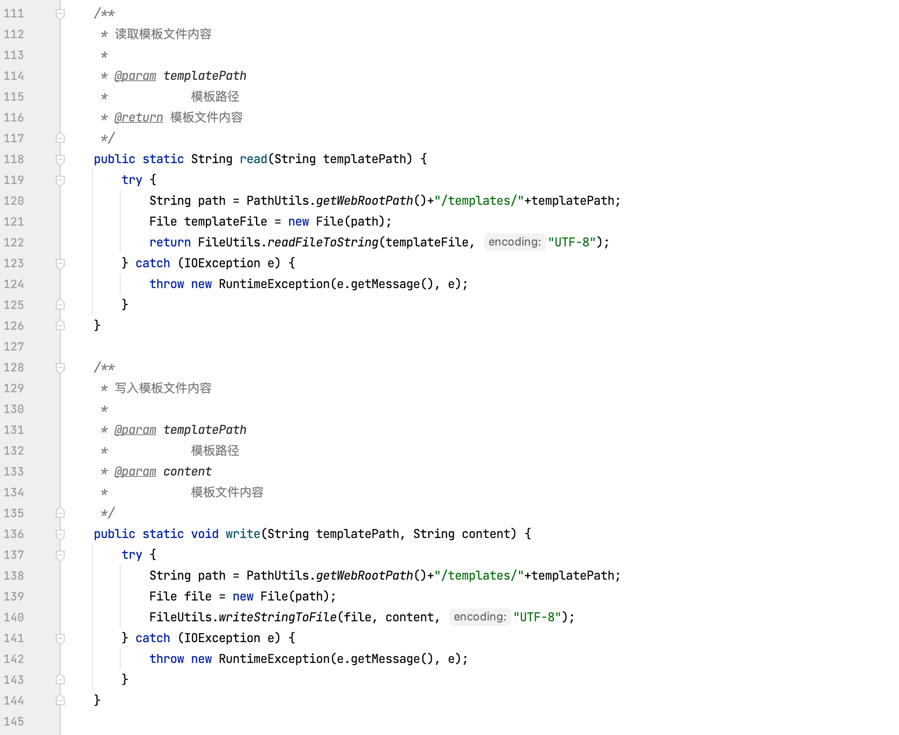

## JreCMS模版注入漏洞

JreCMS极速开发，动态添加字段，自定义标签，动态创建数据库表并crud数据，数据库备份、还原，动态添加站点(多站点功能)，一键生成模板代码，让您轻松打造自己的独立网站，同时也方便二次开发，让您快速搭建个性化独立网站。

后台功能包括：

全局配置（配置参数、模型管理）

基础内容（网站信息、公司信息、内容栏目）

内容管理（内容数据、标签管理）

扩展内容（留言信息、轮播图片、友情链接、自定义表、自定义数据）

公众号管理（微信菜单）

系统管理（站点管理、系统角色、系统用户、数据库管理、模板管理、菜单管理）

JreCMS后台管理系统可以新增模版文件，并在栏目简介里进行调用自定义模版文件，从而我们可以编辑一个存在恶意命令执行的模版文件，并通过其他栏目进行调用从而实现远程命令执行漏洞。

可通过此漏洞执行服务器系统命令，获取系统信息。

漏洞地址：http://ip:8888/admin/template?directory=default

代码下载地址：https://gitee.com/heyewei/SpringBootCMS.git

漏洞位置：登录系统后模版管理新增模版基本内容内容栏目调用自定义模版。

### 漏洞利用

登录后台系统，点击系统管理模版管理，新增模版HTML文件，例如新增一个test.html可以执行“cat /etc/passwd”命令的恶意模版文件。





恶意模版文件新增完成，去基本内容内容栏目，选择一个栏目调用我们刚才新增的恶意模版文件。





设置好后，可以直接访问此栏目即可直接命令执行。



可通过修改执行命令的形式，执行其他命令。

### 代码审计流程

追踪新增模版以及保存模版接口。文件路径：src/main/java/com/cms/controller/admin/TemplateController.java 49、58行


去pom.xml文件中判断引入的模版引擎是Freemarker。



既然是Freemarker，我们在代码中找一下是否存在对模版声明时对某些敏感函数的黑名单过滤，例如Execute等方法。发现src/main/java/com/cms/utils/TemplateUtils.java 分析一下，这个Java类的内容是否存在过滤。



在读写的过程中未对模版的内容进行过滤处理，所以可以判断出存在Freemarker模版注入漏洞。

payload如下：

```java
<#assign value="freemarker.template.utility.Execute"?new()>${value("open -a Calculator")}
<#assign value="freemarker.template.utility.ObjectConstructor"?new()>${value("java.lang.ProcessBuilder","open -a Calculator").start()}
<#assign value="freemarker.template.utility.JythonRuntime"?new()><@value>import os;os.system("open -a Calculator")
```

