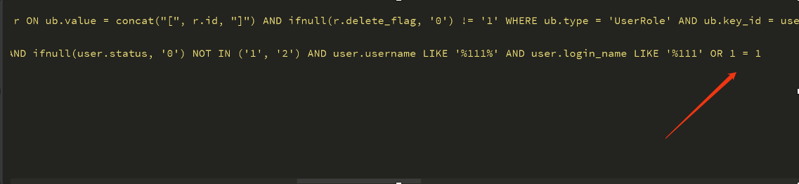

## Huaxia ERP V2.3 SQL Injection Vulnerability

By default, Huaxia ERP integrates users, permissions, menus, routes, classifications, labels, logs, fields, forms, forms, uploads, APIs and other basic functional modules. Huaxia ERP was born for the agile development of WEB applications and the simplification of enterprise application development. The framework, modules, plug-ins and templates can be upgraded and expanded independently.
The query function of Huaxia ERP background in the user management module does not filter the strings returned from the front end, and can directly splice SQL statements, which is vulnerable to SQL injection.
You can steal system database information by constructing SQL statements.

Vulnerability Address：http://IP:8080/index.html#/pages/manage/user.html

Vulnerability Location: On the home page, click System Management - User Management. In the login name input box, insert payload and click Query.

### Exploit

Click System Management - User Management. In the login name input box, insert payload and click Query.

View the background log. It can be seen that the payload is spliced into SQL statements for query.

