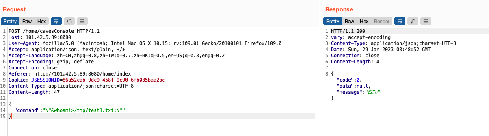
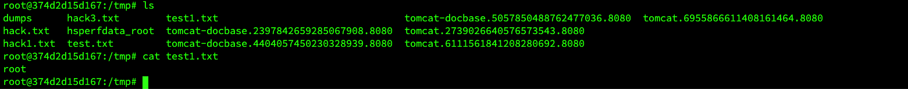

## Dst-admin 1.5.0 background cavesConsole interface remote command execution

An issue was discovered in dst-admin v1.5.0. The product has an background cavesConsole interface remote command execution that can expose sensitive information.

Vulnerability address：http://101.42.5.89:8080/

### Vulnerability exploitation

通过post请求`/home/cavesConsole`接口，传入key为“command”，value为“whoami”之类的命令的json数据，可远程执行命令。

Through the post request '/home/masterConsole' interface, the json data of commands with the key of "command" and the value of "whoami" is passed in, and commands can be executed remotely.

进入docker容器中发现已写入test1.txt文件。

Enter the docker container and find that the test1.txt file has been written.

命令执行成功。

The command was executed successfully.

