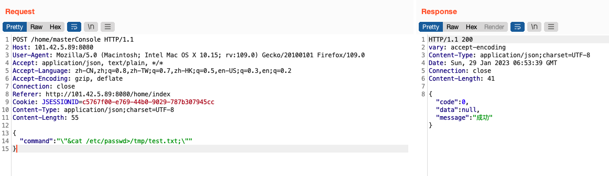
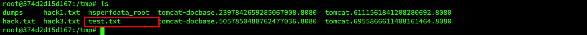
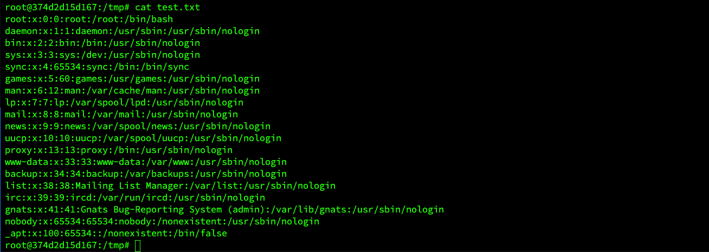

## Dst-admin 1.5.0 background masterConsole interface remote command execution

An issue was discovered in dst-admin v1.5.0. The product has an background masterConsole interface remote command execution that can expose sensitive information.

Vulnerability address：http://101.42.5.89:8080/

### Vulnerability exploitation

通过post请求`/home/masterConsole`接口，传入key为“command”，value为“cat /etc/passwd”之类的命令的json数据，可远程执行命令。

Through the post request '/home/masterConsole' interface, the json data of commands with the key of "command" and the value of "cat /etc/passwd" is passed in, and commands can be executed remotely.

进入docker容器中发现已写入test.txt文件。

Enter the docker container and find that the test.txt file has been written.

命令执行成功。

The command was executed successfully.

