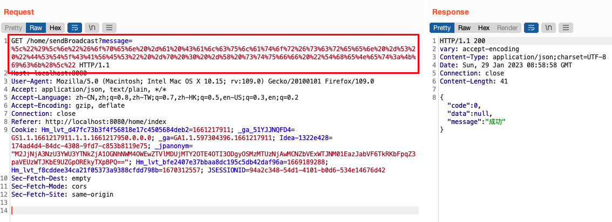

## Dst-admin 1.5.0 background sendBroadcast interface remote command execution

An issue was discovered in dst-admin v1.5.0. The product has an background sendBroadcast interface remote command execution that can expose sensitive information.

Vulnerability address：http://101.42.5.89:8080/


### Vulnerability exploitation

通过get请求`/home/sendBroadcast`接口，传入message，value为“open -a Calculator”之类的命令的字符串，可远程执行命令。

执行时需要将message的值URL编码处理，不然会返回400报错。

POC如下：

```java
\")\n"&open -a Calculator&screen -S "DST_CAVES" -p 0 -X stuff "TheNet:Kick(\"
```

Through the get request '/home/sendBroadcast' interface, a string of commands such as message and value "open - a Calculator" is passed in to execute commands remotely.
The value URL of message needs to be encoded during execution, otherwise an error of 400 will be returned.
The POC is as follows:

```java
\")\n"&open -a Calculator&screen -S "DST_CAVES" -p 0 -X stuff "TheNet:Kick(\"
```



通过后台打印日志可以看出通过c_announce执行message，所以需要闭合c_announce命令，才能执行命令。

The spooling log shows that the message is executed through c_announce, so the c_announce command needs to be closed before the command can be executed.


命令执行成功。

The command was executed successfully.

