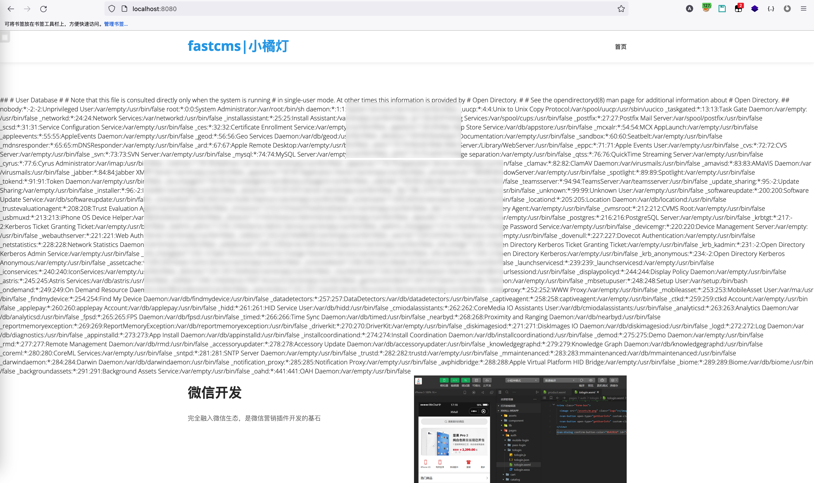

## fastcms template injection vulnerability

Fastcms is built with a complete CMS station building system
Fastcms is fully integrated into the WeChat ecosystem and is the cornerstone of all WeChat marketing plug-ins
Fastcms can be dynamically hot plugged based on jar and zip packages
Fastcms carries out plug-in development based on SpringBoot, which has strong extensibility, freeing you from bloated projects
The fastcms background management system can edit the template file, so that we can edit a template file with malicious command execution, and realize remote command execution vulnerability by accessing the front-end page.
This vulnerability can be used to execute server system commands and obtain system information.
Vulnerability address: http://ip:8080/fastcms.html#/template/edit
Code download address: https://gitee.com/dianbuapp_admin/fastcms.git
Vulnerability location: After logging into the system, the template  Edit  Access this template.

### Exploit

Log in to the background system, click Template  Edit to edit the template HTML file, such as editing index Html A malicious template file that can execute the "cat/etc/passwd" command.


After setting, you can directly access this column to directly execute commands.



Other commands can be executed by modifying the form of execution command.

### Code audit process

Track new templates and save template interfaces. File path: src/main/java/com/cms/controller/admin/TemplateController Java lines 49 and 58.


Go to the pom.xml file to determine that the template engine introduced is Freemaker.


Since it is Freemarker, let's find out in the code whether there is blacklist filtering for some sensitive functions when the template is declared, such as Execute and other methods. Found src/main/java/com/cms/utils/TemplateUtils Java analyzes whether the content of this Java class is filtered.


In the process of reading and writing, the content of the template is not filtered, so it can be determined that there is a Freemarker template injection vulnerability.
Payload is as follows:

```java
<#assign value="freemarker.template.utility.Execute"?new()>${value("open -a Calculator")}
<#assign value="freemarker.template.utility.ObjectConstructor"?new()>${value("java.lang.ProcessBuilder","open -a Calculator").start()}
<#assign value="freemarker.template.utility.JythonRuntime"?new()><@value>import os;os.system("open -a Calculator")
```

