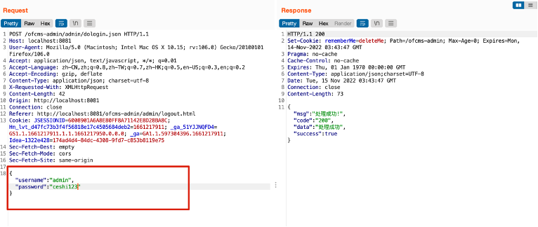

## ofcms后台任意用户密码修改

### 1、漏洞介绍

ofcms是Java 版CMS系统、基于java技术研发的内容管理系统、功能：栏目模板自定义、内容模型自定义、多个站点管理、在线模板页面编辑等功能、代码完全开源、MIT授权协议。

技术选型：jfinal DB+Record mysql freemarker Encache spring 等 layui zTree bootstrap 。

特点：支持多站点、可以根据需求添加手机站、pc站。

ofcms后台系统中普通用户通过修改密码接口中修改id值的形式，修改其他用户的密码，甚至超级管理员密码。

漏洞地址：http://localhost:8081/ofcms-admin/admin/index.html

代码下载地址：https://gitee.com/oufu/ofcms.git

### 2、漏洞验证

##### （1）漏洞定位

分别登录低权限账号和高权限账号，低权限账号可通过修改密码接口，由于后台为对原密码进行校验，即可以通过篡改数据包中的id，来修改对应id的用户密码。  漏洞地址：http://localhost:8081/ofcms-admin/admin/index.html  

##### （2）漏洞触发条件

低权限账号可通过修改密码接口，由于后台为对原密码进行校验，即可以通过篡改数据包中的id，来修改对应id的用户密码。

##### （3）漏洞复现

登录超级管理员账号并创建一个用户名为“ceshi”的普通用户，下图为超级管理员的主页界面。

登录用户名为“ceshi”的普通用户，普通用户的左侧导航栏是空的，无法使用超级管理员功能，下图为普通用户的主页界面。

在普通用户界面点击修改密码后，截取数据包，详情如下图。

普通用户可修改user_id值，来修改其他用户的密码，例如超级管理员的user_id为“1”，我们修改为“1”，即可修改超级管理员密码。

超级管理员的原密码“123456”已被修改为“ceshi123”.

### 3、代码审计

追踪resetpwd.json接口。文件路径： ofcms-master/ofcms-admin/src/main/java/com/ofsoft/cms/admin/controller/system/SysUserController.java 113行

在 respwd这个方法当中，首先会拿到两次输入的密码进行比对，如果不一致则直接返回，一致则将密码进行Sha256Hash进行加密然后set到Record这个对象中，这个Record对象就是封装了一个Map对象，可以对其进行get，set，最关键的一个地方就是，下面还获取了user_id 也并设置到Record对象中。然后执行Db.update。这里以 user_id 作为更新条件 从 record中去获取 user_id ，然后record中的 user_id 的其实就是外部传入的 user_id 。所以才可以通过控制 user_id 来重置任意用户密码。
